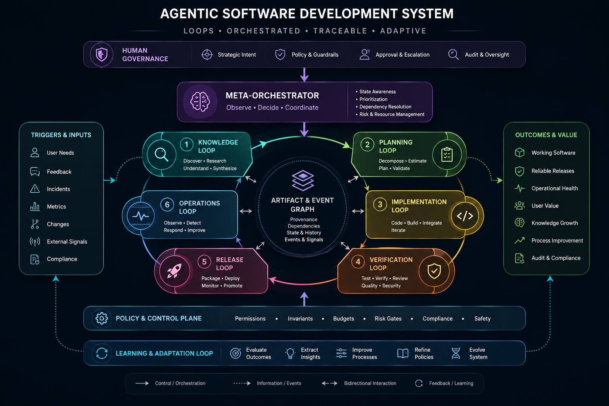

# Helix — Connected development loops vision

**Status:** Product direction. Most loops in this document are not implemented. Shipped behavior remains documented in the README and concrete status remains in [`plan.md`](./plan.md).

Helix should help a small development team operate the full path from knowledge and planning through implementation, review, release, deployment, and production learning. It should do this as a set of independent, inspectable control loops—not as one autonomous mega-agent.

Related: [`architecture.md`](./architecture.md) · [`plan.md`](./plan.md) · [`guardrails.md`](./guardrails.md)



## Core idea

Each loop owns one durable work-object type, reacts to explicit events or a bounded schedule, produces evidence and artifacts, and proposes a state transition. The next loop or a human accepts that handoff.

```text
knowledge / evidence
        ↓
opportunity or hypothesis
        ↓
planned issue
        ↓
implementation run
        ↓
pull request
        ↓
release candidate
        ↓
deployment
        ↓
production observation
        └──────────────→ knowledge / issue
```

The loops may reuse Pi-backed runtime adapters, specialist-session construction, event streaming, persistence patterns, and policy interfaces. They should not share an opaque session or collapse their domain state into the coding-run model.

## Lifecycle loops

| Loop | Durable work object | Primary trigger | Output / handoff | Direction |
|---|---|---|---|---|
| Knowledge and discovery | Opportunity or hypothesis | Scheduled scan plus knowledge changes | Brief, RFC, prototype, experiment, proposed issues | Planned |
| Planning | Milestone or implementation plan | Team cadence, accepted proposal, or new-project request | Prioritized issues or a bootstrap-ready plan | Planned |
| Implementation | Issue | Create, reopen, or command comment | Verified repository change delivered as a new PR | Partially shipped |
| PR control | Pull request at a head SHA | Local review request; later PR, CI, and review events plus reconciliation | Review evidence and merge-readiness decision | Partially shipped |
| Release readiness | Release candidate | Merged changes, milestone, or release schedule | Changelog, risk analysis, rollout and rollback plan | Planned |
| Deployment | Deployment record | Approved release candidate | Staged rollout, verification, production result, rollback | Planned |
| Production learning | Incident or observation | Alert, support report, failed deployment, scheduled analysis | Issue, runbook update, regression proposal, knowledge entry | Planned |
| Maintenance | Maintenance proposal | Dependency/security events plus schedule | Upgrade PR, compatibility report, or accepted risk | Planned |

Event-driven loops should also reconcile on a schedule when external events may be missed or a work object is waiting on changing evidence. Scheduling is a reliability mechanism, not permission to repeat side effects: every trigger and effect requires a stable idempotency identity.

## Loop ownership

### Knowledge and discovery

This loop turns existing knowledge and new evidence into testable proposals. Inputs may include internal docs, architectural decisions, customer feedback, production observations, unresolved issues, prior experiments, and carefully selected external research.

Useful outputs include:

- an opportunity brief or corrected knowledge entry;
- a product or architecture proposal;
- a UI artifact or executable prototype;
- a benchmark or bounded spike branch;
- explicit proposed backlog issues.

A useful lifecycle is:

```text
knowledge change or scheduled cadence
  → identify a gap or opportunity
  → search prior proposals and rejection reasons
  → state a hypothesis and expected value
  → define evaluation criteria and a budget
  → create a bounded artifact or prototype
  → evaluate it
  → human accepts, rejects, or archives it
```

The loop must preserve source provenance and freshness. It must not silently rewrite the knowledge base, promote every idea into implementation, or treat generated plausibility as evidence. Rejected proposals remain searchable so the system does not repeatedly rediscover them.

A proposal should eventually carry at least:

```ts
interface KnowledgeProposal {
  hypothesis: string;
  evidence: SourceReference[];
  affectedUsers: string[];
  expectedValue: string;
  prototypePlan?: string;
  evaluationCriteria: string[];
  estimatedCost: string;
  relatedPriorWork: string[];
  status: "proposed" | "experimenting" | "accepted" | "rejected" | "archived";
}
```

### Planning

Planning converts accepted opportunities and operational needs into a small, ordered backlog. It should clarify scope, dependencies, acceptance criteria, expected value, and risks. It proposes priorities; product authority remains human unless an explicit policy delegates a narrow class of maintenance work.

For an existing project, an accepted plan creates normal issue objects so implementation begins through the same observable issue-triggered path rather than an internal shortcut. For a new project, the same planning loop iterates with the human until it produces a bootstrap-ready plan covering intent, goals and non-goals, success criteria, architecture, repository structure, verified-command expectations, deployment assumptions, and an initial backlog.

The human accepts a specific plan version before bootstrap. Bootstrap is a one-time executor, not another control loop: it creates and validates the repository foundation, baseline knowledge, tooling, and initial issues from the accepted plan. If execution exposes a foundational conflict, it returns evidence to planning for revision instead of silently redesigning the project.

```text
planning loop
  ├─ existing project → accepted plan → issues
  └─ new project → accepted bootstrap plan → bootstrap executor → issues
```

### Implementation

The implementation loop consumes an issue and produces a verified change. Issue creation, reopen, and explicit issue command comments are external workflow triggers. Continuations remain fresh linked runs with bounded lineage context.

The Git behavior is one isolated worktree, one named feature branch, and one new PR for every successful Acme-linked change-producing run. Helix creates the branch from the configured base SHA before agent execution, lets the Dev commit logically, safely commits remaining changes at the host boundary, then registers the exact base/head SHAs as a draft PR in Acme Issues. Successful registration removes the temporary checkout while retaining the branch; failures retain the workspace for diagnosis. Helix delivers the PR and stops; it does not authorize its own merge.

### PR control

PR control is logically independent from implementation. The shipped local slice consumes Helix-created or manually registered external PRs. Acme Issues owns the human-facing PR record and UI; Helix owns review execution, durable PR-review runs, specialist evidence, and deterministic readiness policy.

Today it reacts to an explicit local review request. It resolves the exact base/head commits, creates a detached temporary worktree at the head SHA, runs independent reviewer and verifier specialists concurrently, parses structured reports, and returns `ready_to_merge`, `changes_requested`, or `blocked`. Acme Issues rejects stale results when the stored head SHA changed. Automatic event reconciliation, conditional specialists, authorized fixes, and hosted-provider adapters remain planned.

Its identity includes repository, PR number, base branch, head branch, head SHA, author, trigger, and external event ID. It must ignore self-authored events and deduplicate effects to avoid bot feedback loops. Merge belongs to PR-control policy or an explicit human decision.

### Release readiness

Release readiness evaluates the group of merged changes since the previous release. It proposes a version, changelog, migration and configuration requirements, compatibility risks, documentation gaps, rollout steps, and rollback instructions. Its result is an immutable release candidate or proposal—not an implicit production deployment.

### Deployment

Deployment has a stronger permission boundary than coding. A deployment loop consumes an approved release candidate, runs preflight checks, deploys to staging, executes smoke tests, requests production approval when required, performs a progressive rollout, monitors bounded health signals, and applies a deterministic rollback policy.

Agents may interpret evidence and recommend action. Credentials, environment selection, approval, deploy commands, and rollback thresholds remain host-owned and auditable.

### Production learning

Production learning closes the lifecycle. It consumes alerts, exceptions, performance changes, failed deployments, support reports, and user feedback. It correlates and deduplicates observations, then proposes an incident record, issue, regression test, runbook correction, or knowledge update.

It should connect outcomes back to their release, deployment, PR, issue, and originating knowledge proposal when known. This makes the system learn from results rather than merely increase delivery volume.

### Maintenance

Maintenance watches dependencies, security advisories, runtime deprecations, certificate or credential expiry, and routine operational hygiene. It proposes bounded upgrades or accepted-risk records through the same issue and PR paths. High-severity alerts can trigger immediately; ordinary upgrades should be grouped on a predictable cadence to control noise.

## Shared control-plane contract

Every loop should provide the same operational qualities without sharing one domain model:

1. **Explicit work object and owner.** The loop knows exactly which object and state transition it controls.
2. **Stable trigger identity.** Webhooks, comments, schedules, and retries are idempotent.
3. **Bounded context.** Inputs are selected, attributable, size-limited, and fresh enough for the decision.
4. **Evidence-bearing output.** Claims link to tests, checks, sources, logs, diffs, or measured results.
5. **Deterministic gates.** Consequential policy is enforced outside prompts.
6. **Human authority where it matters.** Product priority, merge, production deployment, rollback exceptions, and proposal promotion remain explicit decisions unless narrowly delegated.
7. **Durable state and events.** Work can be inspected, retried safely, and correlated across loop boundaries.
8. **Independent failure.** A broken discovery, PR, or deployment loop does not corrupt another loop's state.
9. **Local-first core.** Hosted integrations are adapters; the control-plane truth remains portable and headlessly runnable.

## Suggested implementation order

For a small team, reliability should grow before idea volume:

1. Independent PR-control loop.
2. Run-scoped Git delivery for implementation runs.
3. Release-readiness loop.
4. Deployment verification and rollback loop.
5. Production-learning loop.
6. Knowledge/discovery and prototype loop.
7. Broader planning and portfolio automation.
8. Scheduled maintenance automation where recurring cost justifies it.

The knowledge loop is strategically valuable, but building it before review, release, and production feedback would create more proposed work without a reliable system for evaluating delivery and outcomes.

## Non-goals

- One agent or transcript that owns the entire software lifecycle.
- Silent promotion from generated idea to production work.
- Scheduled polling that repeats non-idempotent side effects.
- A PR reviewer that reviews and approves its own implementation without independent policy.
- Deployment authority hidden in a specialist prompt or model tool list.
- Replacing human product judgment with a backlog-scoring model.

## Success criteria

This vision succeeds when a small team can see why work exists, what evidence moved it forward, which control loop currently owns it, what decision is waiting, and how production outcomes feed the next planning or knowledge cycle—without surrendering local operation or human authority over consequential transitions.
